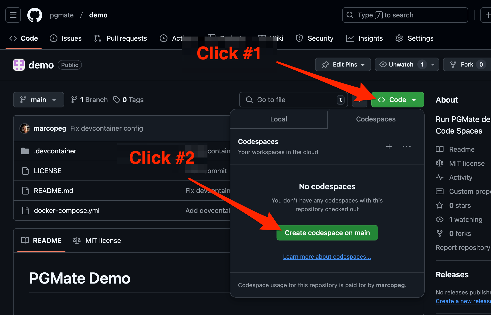
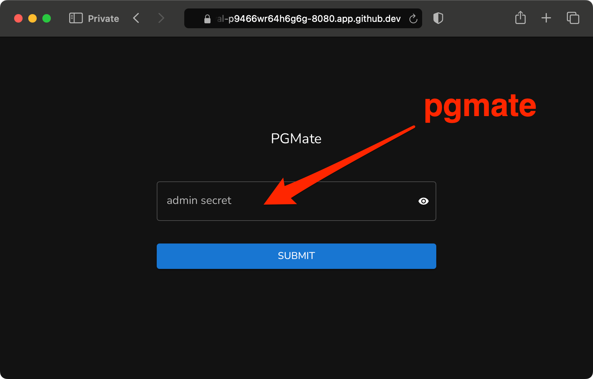
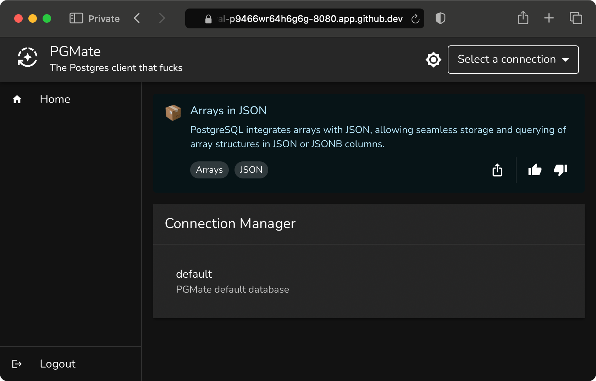
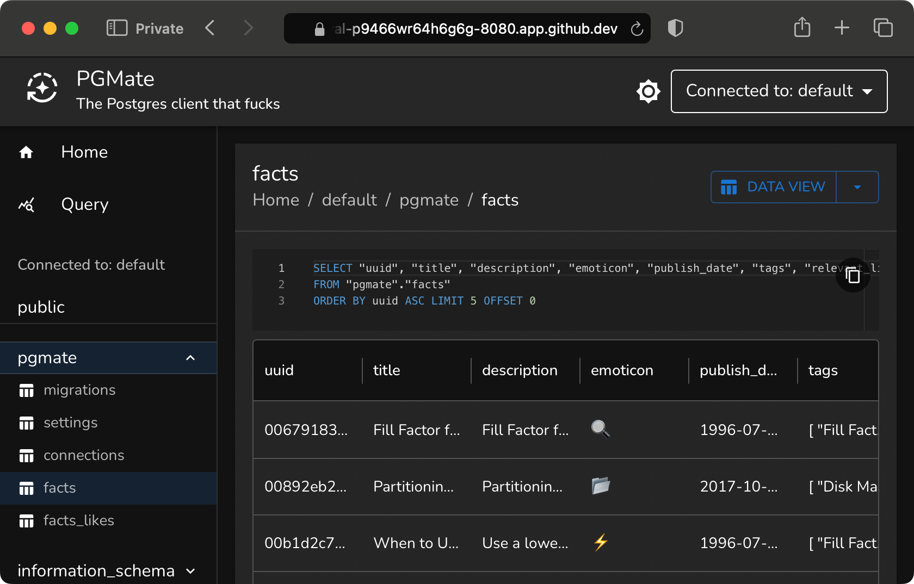
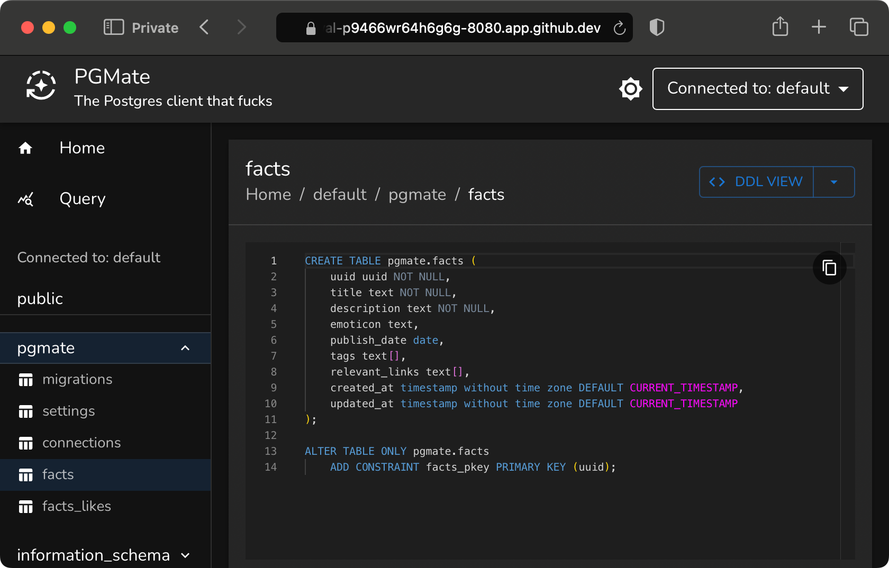

# PGMate Demo

## Run it in GitPod

Just click this button to run PGMate demo in the Cloud with GitPod.io:

[](https://gitpod.io/#https://github.com/pgmate/demo)

## Run it as GitHub CodeSpace

If you are reading this document from our GitHub page, follow these instructions and run PGMate demo in the Cloud:

1. Click on: `Code`
2. Click on: `Create codespace on main`
3. Take a cup of coffee...



A cloud-native development environment will open in a new tab and the project will be automatically initialized.

Within a couple of minutes, PGMate login page will open automatically.

## Clone and run it locally

```bash
# Clone the demo:
git clone https://gitpod.io/#https://github.com/pgmate/demo pgmate

# Run with Docker:
cd pgmate
docker compose up
```

## Login to PGMate

This demo environment starts with the default password: `pgmate`.



Once you login, you can navigate the schema of the `Default Connection`:



Open a table in `Data View`:



Or export a table's DLL:

